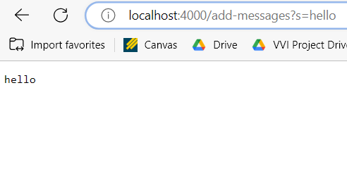
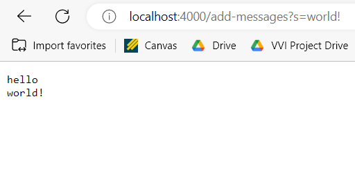

# Lab Report 2 #
## Part 1 ##

***StringServer.java:***
```
import java.io.IOException;
import java.net.URI;

class Handler implements URLHandler {
    // The one bit of state on the server: a number that will be manipulated by
    // various requests.

    String message = "";

    public String handleRequest(URI url) {
        if (url.getPath().equals("/")) {
            return message;
        }
        else {
            System.out.println("Path: " + url.getPath());
            if (url.getPath().contains("/add-messages")) {
                if (url.getQuery().startsWith("s=")) {
                    message += url.getQuery().substring(2) + "\n";
                    return message;
                }
                else {
                    return "404 Not Found";
                }
            }
            return "404 Not Found!";
        }
    }
}

class StringServer {
    public static void main(String[] args) throws IOException {
        if(args.length == 0){
            System.out.println("Missing port number! Try any number between 1024 to 49151");
            return;
        }

        int port = Integer.parseInt(args[0]);

        Server.start(port, new Handler());
    }
}
```
  
**StringServer Example 1:**



When the server is first started, there exists a String ```message``` that defaults to an empty string ```""```.

When I enter the url ```http://localhost:4000/add-messages?s=hello```, the method ```handleRequest()``` is called with an instance of the URI class determined from the given URL passed as an argument. Inside the method body, the method first calls ```.getPath()``` on the URI argument and checks to see if it is equivalent to only ```"\"```, which in this case it is not. 
Then, it goes to the ```else``` block and calls ```.getPath()``` on the URI argument again and prints the path to the terminal of the machine hosting the server. Next, it calls ```.getPath()``` on the URI argument again and calls ```.contains("/add-messages")``` to see if the path is the correct one intenteded for adding a message to the screen. 
In this case, the path does contain ```"/add-messages"```, so it then calls ```.getQuery()``` on the the URI argument to get the query, then calls ```.startsWith("s=")``` on the String returned by ```.getQuery()``` to check if there is a query formatted in the defined correct way, which is defined as ```s=[message to add]```. 
In this case, the query is formatted correctly so it appends the message to add followed by a new line to the field ```message```, where the message to add is determined by calling ```.substring(2)``` on the String returned by calling  ```.getQuery()``` on the URI argument which removes ```"s="``` from the string representing the query. 
The message it appends in this case is ```"hello\n"``` since ```.getQuery()``` returns the String ```"s=hello"```. It then returns the updated ```message``` which is now equal to ```"hello\n"```. 
```message``` is then dispayed on the screen through backend code running as a part of the server.

**StringServer Examples 2:**



At this point, the field ```message``` in the ```Handler``` class is ```"hello\n"```.

When I enter the url ```http://localhost:4000/add-messages?s=world!```, the method ```handleRequest()``` is called with an instance of the URI class determined from the given URL passed as an argument. Inside the method body, the method first calls ```.getPath()``` on the URI argument and checks to see if it is equivalent to only ```"\"```, which in this case it is not. 
Then, it goes to the ```else``` block and calls ```.getPath()``` on the URI argument again and prints the path to the terminal of the machine hosting the server. Next, it calls ```.getPath()``` on the URI argument again and calls ```.contains("/add-messages")``` to see if the path is the correct one intenteded for adding a message to the screen. 
In this case, the path does contain ```"/add-messages"```, so it then calls ```.getQuery()``` on the the URI argument to get the query, then calls ```.startsWith("s=")``` on the String returned by ```.getQuery()``` to check if there is a query formatted in the defined correct way, which is defined as ```s=[message to add]```. 
In this case, the query is formatted correctly so it appends the message to add followed by a new line to the field ```message```, where the message to add is determined by calling ```.substring(2)``` on the String returned by calling  ```.getQuery()``` on the URI argument which removes ```"s="``` from the string representing the query. 
The message it appends in this case is ```"world!\n"``` since ```.getQuery()``` returns the String ```"s=world!"```. It then returns the updated ```message``` which is now equal to ```"hello\nworld!\n"```. 
```message``` is then dispayed on the screen through backend code running as a part of the server.

## Part 2 ##
*** Failure-Inducing Input***


## Part 3 ##
